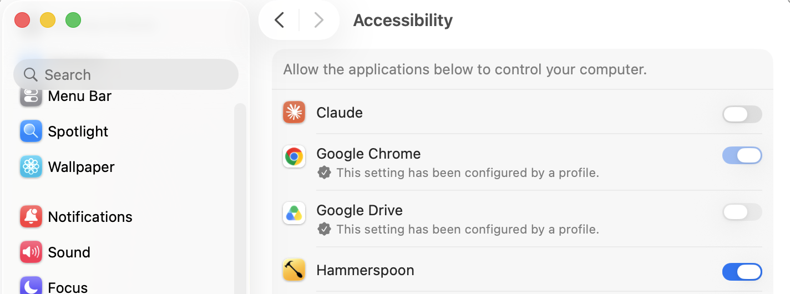
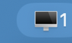
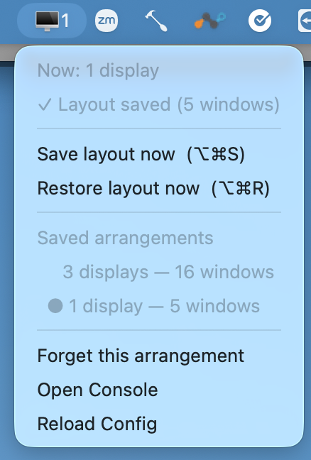
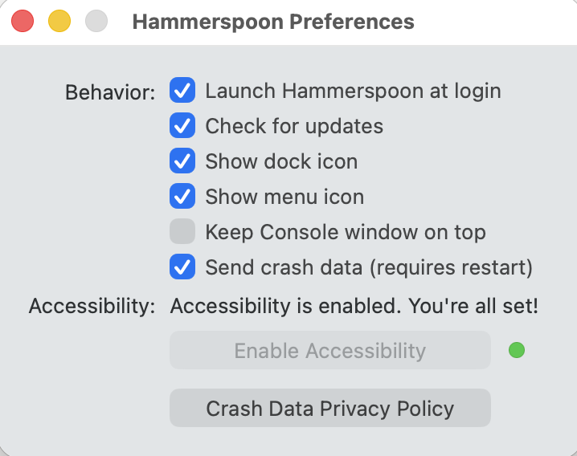

# Monitor Window Memory

Remembers where every window lives for each monitor arrangement, and puts them
back when you disconnect / reconnect displays.

Built on [Hammerspoon](https://www.hammerspoon.org/). Fixes the classic macOS
annoyance where unplugging your externals squishes every window onto the laptop
screen — and reconnecting doesn't put them back.

## What it does

- Fingerprints each set of connected screens (e.g. "laptop only" vs
  "laptop + 2 externals").
- You save a layout when you want one (⌥⌘S or the menubar) — it's stored for
  the current arrangement and persisted to disk (survives reboots). Nothing is
  saved automatically and there's no background polling.
- When you connect/disconnect monitors — or wake the Mac from sleep — it
  restores the saved layout for the current arrangement, retrying a few times to
  beat macOS's own reshuffle.
- A menubar readout (🖥 + screen count) shows the active arrangement and lets
  you save / restore / forget layouts by hand.

Hotkeys:

| Shortcut | Action |
|----------|--------|
| `⌥⌘S` | Save the current layout for this monitor setup now |
| `⌥⌘R` | Restore the saved layout for this monitor setup now |

---

## Setup

### 1. Install

```bash
git clone https://github.com/randytayler/monitor-window-memory.git
cd monitor-window-memory
./install.sh
```

The installer will:
1. Install Hammerspoon via Homebrew (if you don't already have it).
2. Copy the config into `~/.hammerspoon/init.lua` (backing up any existing one).
3. Launch Hammerspoon and open the Accessibility settings pane.

> **No `git`, or grabbed the ZIP instead of cloning?** Run `bash install.sh` —
> it works even when the file isn't marked executable.

**Prefer to do it by hand?** Install Hammerspoon
(`brew install --cask hammerspoon`), copy [`init.lua`](init.lua) to
`~/.hammerspoon/init.lua`, and launch Hammerspoon.

### 2. Grant Accessibility permission

macOS won't let **any** app move windows until you allow it, and this can't be
scripted (it's an OS security setting). In **System Settings ▸ Privacy &
Security ▸ Accessibility**, turn on the switch next to **Hammerspoon**:



Then click the Hammerspoon menubar icon ▸ **Reload Config**.

> Saving your layout works without this. *Restoring* windows needs it.

### 3. Find the menubar icon

Look for the 🖥 icon in your menubar. The number is how many displays are
connected right now:



> **Don't see it?** On MacBooks with a notch, a crowded menubar can hide icons
> behind the notch. See [Troubleshooting](#troubleshooting).

### 4. Use the menu

Click the icon for the menu. It shows the current arrangement, whether a layout
is saved, and every arrangement it remembers — plus manual **Save** / **Restore**:



### 5. Confirm it's set to launch at login

The installer turns this on for you. To check, open **Hammerspoon ▸
Preferences** — "Launch Hammerspoon at login" should be ticked and Accessibility
should read *enabled*:



---

## Using it day to day

1. With all your monitors connected, arrange windows how you like them, then
   press **⌥⌘S** (or menubar ▸ **Save layout now**) to remember that
   arrangement.
2. Disconnect your externals, arrange the laptop-only windows how you like, and
   press **⌥⌘S** again to save that arrangement too.
3. From then on, connecting or disconnecting monitors — or waking the Mac from
   sleep — auto-restores the saved layout for whatever arrangement is active.

**Save each arrangement once.** Nothing is saved automatically — a layout is
only stored when you explicitly save it, so the tool does no background work.
The menubar icon shows a `•` next to arrangements that don't have a saved layout
yet.

---

## Troubleshooting

**Can't see the 🖥 menubar icon.** On notch MacBooks, macOS hides overflow
menubar icons behind the notch when the bar is crowded — so a busy laptop-only
menubar can swallow it. Fixes:

- Quit a menubar app or two to free up space, and it reappears.
- Hold **⌘** and drag menubar icons to rearrange them out from behind the notch.
- Install a free menubar manager like
  [Ice](https://github.com/jordanbaird/Ice) (`brew install --cask jordanbaird-ice`)
  so overflow icons are never hidden again.

**Windows restore to *almost* the right spot.** macOS is still settling the
displays when the first restore fires. Increase the retry delays — see
[Tuning](#tuning).

**Nothing restores on reconnect.** The arrangement has to be saved at least once
first. Set your windows up the way you want with the monitors connected, press
**⌥⌘S**, and it'll restore that arrangement from then on.

---

## If you already use Hammerspoon

This ships as a whole `init.lua`, so the installer **replaces** your existing
config (after backing it up to `~/.hammerspoon/init.lua.backup-<timestamp>`). If
you already have a Hammerspoon setup you want to keep, don't use `install.sh` —
instead copy the body of [`init.lua`](init.lua) into your own config, or package
it as a Spoon.

## Tuning

Open [`init.lua`](init.lua) and edit the values near the top:

- `RESTORE_DELAYS` — when (seconds after a monitor change) restore is retried.
  If restores land slightly off, add more / later delays here.
